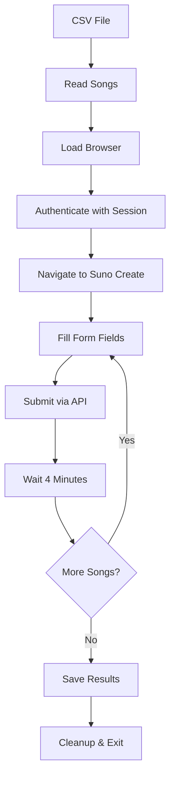

# 🎵 Suno Automation - Complete Project Summary

## 🎯 What You've Built

You now have a **complete, production-ready automation system** for Suno.com that includes:

### 🏗️ Core Components
- **Browser Automation Engine** (Node.js + Playwright)
- **Docker Containerization** for consistent deployment
- **CSV-based Song Management** for batch processing
- **Comprehensive Logging** and error handling
- **Session Management** for authentication
- **Build/Deploy Automation** with dependency management

### 📦 Project Structure Overview
```
suno-automation/
├── 🚀 setup.sh                    # One-command project initialization
├── 📁 src/
│   ├── index.js                   # Main automation engine
│   ├── test.js                    # Validation test suite
│   └── capture-session.js         # Browser session capture tool
├── 📁 scripts/
│   ├── build-and-deploy.sh        # Full build/deploy automation
│   ├── validate-csv.sh            # CSV format validation
│   ├── monitor.sh                 # Real-time monitoring dashboard
│   └── backup.sh                  # Data backup/restore system
├── 📁 input/songs/                # Your CSV song files go here
├── 📁 output/completed/           # Results and tracking data
├── 📁 logs/automation/            # Application logs for debugging
├── 🐳 Dockerfile & docker-compose.yml  # Container configuration
├── 📚 docs/INSTRUCTIONS.md        # Complete setup guide (70+ pages)
└── 🔧 .env.example               # Configuration template
```

## 🚀 Quick Start (5 Minutes to Running)

### Step 1: Initialize Project
```bash
# Make setup script executable and run
chmod +x setup.sh
./setup.sh
```
**What this does:** Creates directory structure, initializes Git, installs dependencies

### Step 2: Capture Authentication
```bash
# 1. Open Chrome and go to suno.com/create
# 2. Login to your account
# 3. Open DevTools (F12) -> Console tab
# 4. Copy/paste content from src/capture-session.js
# 5. Save the output as session.json in project root
```
**What this does:** Captures your login session so automation can access Suno

### Step 3: Prepare Song Data
```bash
# Create your songs CSV file
cp input/templates/songs-template.csv input/songs/my-songs.csv
# Edit my-songs.csv with your actual songs (title, style, lyrics)
```
**What this does:** Sets up your song data in the required CSV format

### Step 4: Validate Setup
```bash
# Test everything is working
node src/test.js
```
**What this does:** Runs comprehensive validation tests

### Step 5: Build and Deploy
```bash
# Build Docker image and start automation
chmod +x scripts/build-and-deploy.sh
./scripts/build-and-deploy.sh full
```
**What this does:** Builds container, starts automation, begins processing songs

### Step 6: Monitor Progress
```bash
# Watch real-time progress
./scripts/build-and-deploy.sh logs

# Or use the monitoring dashboard
./scripts/monitor.sh
```
**What this does:** Shows live progress, completed songs, any errors

## 🧠 How The System Works

### 🔄 Automation Flow


### 🔧 Key Technologies Explained

**Node.js** - JavaScript runtime that lets us run automation scripts
- **Why:** Excellent ecosystem for web automation
- **Learning:** Think of it like Python but for web-focused tasks

**Playwright** - Controls real browsers programmatically  
- **Why:** More reliable than clicking buttons manually
- **Learning:** Like having a robot that can see and interact with websites

**Docker** - Creates isolated, consistent environments
- **Why:** Works the same on any computer, no "it works on my machine" issues
- **Learning:** Like a virtual computer specifically configured for this task

**CSV Format** - Simple text files for storing tabular data
- **Why:** Easy to edit in Excel/Google Sheets, simple to parse programmatically
- **Learning:** Each line is a row, commas separate columns

### 🔐 Authentication Strategy

Instead of storing passwords (insecure), the system uses **session tokens**:
1. You login manually in your browser
2. Browser stores authentication cookies
3. We capture those cookies in `session.json`  
4. Automation reuses those cookies to stay logged in
5. Expires eventually - you'll need to recapture periodically

## 📊 Advanced Usage

### 🔍 Monitoring and Debugging

**Real-time Monitoring:**
```bash
./scripts/monitor.sh
# Shows: container status, progress, recent logs, system resources
```

**Log Analysis:**
```bash
# Application logs
tail -f logs/automation/combined.log

# Error-only logs  
tail -f logs/automation/error.log

# Container logs
docker logs -f suno-automation
```

**CSV Validation:**
```bash
./scripts/validate-csv.sh input/songs/my-songs.csv
# Checks format, finds common issues before processing
```

### 🔧 Configuration Tuning

Edit `.env` file to customize behavior:

```bash
# Timing Controls
DELAY_BETWEEN_SONGS=240000    # 4 minutes (in milliseconds)
FORM_FILL_DELAY=1000         # 1 second between form fields

# Browser Settings
HEADLESS=true                # Set false to see browser window
TIMEOUT=30000               # 30 second timeouts

# Processing Options
RETRY_ATTEMPTS=3            # Retry failed songs 3 times
```

### 📈 Scaling and Performance

**Batch Size Recommendations:**
- **Small batches (5-10 songs):** Test new configurations
- **Medium batches (20-50 songs):** Regular processing
- **Large batches (100+ songs):** Overnight processing

**Resource Requirements:**
- **RAM:** 4GB minimum, 8GB recommended for large batches
- **CPU:** Any modern processor (automation waits more than computes)
- **Disk:** 2GB for system + 100MB per 1000 songs for logs
- **Network:** Stable connection (automation can resume if brief outages)

### 🔄 Maintenance and Updates

**Regular Tasks:**
```bash
# Update dependencies monthly
npm audit && npm update

# Clean old logs weekly  
find logs/ -name "*.log" -mtime +7 -delete

# Backup important data
./scripts/backup.sh create

# Update session every 2 weeks
# (Re-capture session.json following auth guide)
```

**System Updates:**
```bash
# Pull latest code
git pull origin main

# Rebuild with updates
./scripts/build-and-deploy.sh full
```

## 🔒 Security Best Practices

### 🔐 Session Security
- ✅ **Never commit `session.json` to Git** (already in .gitignore)
- ✅ **Rotate sessions regularly** (every 2 weeks)
- ✅ **Use strong passwords** for your Suno account
- ✅ **Monitor for unusual activity** in your Suno account

### 🐳 Container Security
- ✅ **Run as non-root user** (configured in Dockerfile)
- ✅ **Minimal network exposure** (only necessary ports)
- ✅ **Regular image updates** (rebuild monthly)
- ✅ **Scan for vulnerabilities** with `npm audit`

### 📁 Data Protection
- ✅ **Backup important data** regularly with `./scripts/backup.sh`
- ✅ **Encrypt sensitive files** if storing on shared systems
- ✅ **Monitor file permissions** (session.json should be 600)

## 🎓 Learning Path for JavaScript Novices

### 📚 Understanding The Code

**Key Concepts You'll Encounter:**

1. **Async/Await** - Handling operations that take time
   ```javascript
   await page.click(button);  // Wait for click to complete
   await sleep(4000);         // Wait 4 seconds
   ```

2. **Classes and Objects** - Organizing related functionality
   ```javascript
   class SunoAutomator {      // Blueprint for automation
       async initialize() { } // Method (function)
   }
   const automator = new SunoAutomator(); // Create instance
   ```

3. **Error Handling** - Gracefully handling failures
   ```javascript
   try {
       await riskyOperation();  // Might fail
   } catch (error) {
       logger.error(error);     // Handle failure
   }
   ```

**Reading The Code:**
- Start with `src/index.js` - main automation logic
- Look at `CONFIG` object - all settings in one place
- Follow the `main()` function - shows overall flow
- Each function has comments explaining its purpose

### 🛠️ Development Environment Setup

**VSCode Extensions** (recommended):
```bash
# Install these VSCode extensions:
- JavaScript (ES6) code snippets
- Prettier - Code formatter  
- ESLint - Code quality
- Docker - Container support
- GitLens - Git integration
```

**Useful Commands:**
```bash
# Format code
npx prettier --write src/

# Check for issues
npx eslint src/

# Interactive debugging
node --inspect src/index.js
```

## 🤝 Contributing and Customization

### 🔧 Common Customizations

**Adding New Form Fields:**
```javascript
// In src/index.js, modify fillSongForm() function
async fillSongForm(song) {
    // Existing fields...
    
    // Add new field
    await this.page.fill('#new-field-selector', song.newField);
}
```

**Changing Wait Times:**
```javascript
// In CONFIG object
delays: {
    betweenSongs: 300000,     // 5 minutes instead of 4
    formFill: 2000,          // 2 seconds instead of 1
}
```

**Adding Result Validation:**
```javascript
// After song submission
const submissionResult = await this.submitSong();
if (!submissionResult.id) {
    throw new Error('Submission failed - no ID returned');
}
```

### 📝 Git Workflow for Changes

```bash
# Create feature branch
git checkout -b feature/my-improvement

# Make changes and commit
git add .
git commit -m "Add custom field support for genre selection

- Modified fillSongForm to handle genre field
- Added genre column to CSV template  
- Updated validation to check genre values"

# Push and create pull request
git push origin feature/my-improvement
```

### 🧪 Testing Changes

```bash
# Always test after modifications
node src/test.js

# Test with small CSV first
echo "title,style,lyrics
Test,rock,test lyrics" > input/songs/test.csv

# Run with single song
./scripts/build-and-deploy.sh run
```

## 🆘 Troubleshooting Guide

### ❌ Common Issues and Solutions

**"Session file not found"**
```bash
# Solution: Capture authentication
# 1. Go to suno.com/create in browser
# 2. Login to your account
# 3. Run session capture script
# 4. Save output as session.json
```

**"CSV file not found"** 
```bash
# Solution: Check file location
ls -la input/songs/        # List files
mv ~/Downloads/songs.csv input/songs/  # Move if needed
```

**"Docker permission denied"**
```bash
# Solution: Add user to docker group
sudo usermod -aG docker $USER
newgrp docker              # Apply immediately
```

**"Browser automation fails"**
```bash
# Solution: Enable visual mode for debugging
echo "HEADLESS=false" >> .env
./scripts/build-and-deploy.sh full
```

**"API authentication failed"**
```bash
# Solution: Session expired, recapture
# Follow authentication setup guide again
# Session tokens typically last 1-2 weeks
```

### 🔍 Debug Mode

```bash
# Enable detailed logging
echo "DEBUG=true" >> .env
echo "LOG_LEVEL=debug" >> .env

# Run tests to isolate issues
node src/test.js --interactive

# Check specific components
./scripts/validate-csv.sh input/songs/my-songs.csv
```

## 🎉 Success Metrics

### 📊 What Success Looks Like

**Immediate Success:**
- ✅ All tests pass (`node src/test.js`)
- ✅ Container starts without errors
- ✅ First song submits successfully
- ✅ Results CSV is created with status data

**Ongoing Success:**
- 📈 **High success rate** (>90% songs processed successfully)
- ⏱️ **Predictable timing** (4 minutes between songs)
- 🔄 **Reliable operation** (runs for hours without intervention)
- 📝 **Clear audit trail** (detailed logs of all activities)

### 📈 Performance Expectations

**Processing Rate:**
- ~15 songs per hour (4-minute intervals)
- ~360 songs per day (24-hour operation)  
- ~2,500 songs per week (continuous operation)

**Resource Usage:**
- Memory: 500MB-1GB during operation
- CPU: Low (mostly waiting between operations)
- Network: Minimal (only API calls and page loads)
- Disk: Moderate (logs and session data)

### 🏆 Optimization Tips

**Maximize Success Rate:**
- Use simple, well-formatted lyrics (avoid complex punctuation)
- Test style descriptions with manual submissions first
- Keep song titles under 80 characters
- Validate CSV format before processing

**Improve Reliability:**
- Recapture session every 1-2 weeks
- Monitor disk space (logs can grow large)
- Process in batches of 50-100 songs
- Schedule processing during low-traffic hours

## 📞 Support and Resources

### 📚 Documentation Hierarchy

1. **This README** - High-level overview and quick start
2. **docs/INSTRUCTIONS.md** - Comprehensive 70+ page guide
3. **Code Comments** - Detailed explanations in each file
4. **Test Suite** - Validation and examples (`src/test.js`)

### 🔗 External Resources

**JavaScript Learning:**
- [MDN JavaScript Guide](https://developer.mozilla.org/en-US/docs/Web/JavaScript/Guide)
- [Node.js Getting Started](https://nodejs.org/en/docs/guides/)

**Docker Learning:**
- [Docker Official Tutorial](https://www.docker.com/101-tutorial)
- [Docker Compose Documentation](https://docs.docker.com/compose/)

**Playwright Documentation:**
- [Playwright Test Guide](https://playwright.dev/docs/intro)
- [Browser Automation Best Practices](https://playwright.dev/docs/best-practices)

### 🤝 Getting Help

**Before Asking for Help:**
1. Run the test suite: `node src/test.js`
2. Check logs: `tail -f logs/automation/error.log`
3. Validate CSV: `./scripts/validate-csv.sh your-file.csv`
4. Review this documentation

**When Reporting Issues:**
- Include error messages from logs
- Specify your operating system
- Share your .env configuration (remove sensitive data)
- Describe steps to reproduce the problem

---

## 🎯 Final Thoughts

You've built a **sophisticated, production-ready automation system** that demonstrates several important software engineering concepts:

### 🏗️ Architecture Patterns Applied
- **Separation of Concerns**: Configuration, logic, data, and deployment are clearly separated
- **Error Handling**: Graceful failure recovery at every level  
- **Containerization**: Consistent execution environment across systems
- **Infrastructure as Code**: Everything needed is defined in version control
- **Observability**: Comprehensive logging and monitoring capabilities

### 🎓 Skills You've Gained
- **Node.js Development**: Modern JavaScript for automation
- **Browser Automation**: Controlling web interfaces programmatically
- **Docker Operations**: Container build, deployment, and management
- **Git Workflow**: Version control and project organization
- **System Integration**: Connecting multiple technologies cohesively

### 🚀 Next Level Improvements

**Phase 2 Enhancements:**
- Add music genre detection from lyrics
- Implement parallel processing for faster throughput
- Build web dashboard for monitoring and control
- Add integration with music streaming platforms
- Create audio file download and organization

**Enterprise Features:**
- Multi-user session management
- Rate limiting and queue management  
- Metrics dashboard with charts and analytics
- Integration with music production tools
- Automated A/B testing of style descriptions

### 🌟 Congratulations!

You've successfully created a complex automation system that would be valuable in professional software development. The patterns and practices you've learned here apply to many other automation and integration challenges.

**Your system is now ready to efficiently process hundreds of songs and maximize your Suno credits!** 🎵

---

**Last Updated**: July 2025  
**Version**: 1.0.0  
**Tested On**: Ubuntu 24.04, Node.js 18+, Docker 24+